# ATP — Adesh Transport Protocol

## A New Message-Oriented Transport Protocol for AdeshLang

**Status:** Experimental / Architecture Specification  
**Version:** ATP/0.1  
**Language:** AdeshLang  
**Transport substrate:** UDP/IP initially  
**Primary goals:** Low overhead, low memory consumption, high throughput, low latency, selective reliability, multiplexing, security, efficient fragmentation, and Adesh-native integration.

---

# Table of Contents

1. [Executive Summary](#1-executive-summary)
2. [Why ATP Exists](#2-why-atp-exists)
3. [Design Goals](#3-design-goals)
4. [Non-Goals](#4-non-goals)
5. [Fundamental Design Principles](#5-fundamental-design-principles)
6. [ATP Architecture](#6-atp-architecture)
7. [Protocol Layering](#7-protocol-layering)
8. [Connection / Session / Stream / Message Model](#8-connection--session--stream--message-model)
9. [ATP Packet Model](#9-atp-packet-model)
10. [ATP Frame Model](#10-atp-frame-model)
11. [Packet Header Design](#11-packet-header-design)
12. [Header Context Compression](#12-header-context-compression)
13. [Message Model](#13-message-model)
14. [Fragmentation and Reassembly](#14-fragmentation-and-reassembly)
15. [Reliability Model](#15-reliability-model)
16. [Acknowledgement Model](#16-acknowledgement-model)
17. [Loss Detection](#17-loss-detection)
18. [Retransmission](#18-retransmission)
19. [Ordering](#19-ordering)
20. [Multiplexing](#20-multiplexing)
21. [Flow Control](#21-flow-control)
22. [Backpressure](#22-backpressure)
23. [Memory Architecture](#23-memory-architecture)
24. [Zero-Copy Architecture](#24-zero-copy-architecture)
25. [Congestion Control](#25-congestion-control)
26. [Path MTU and Packet Sizing](#26-path-mtu-and-packet-sizing)
27. [Connection Establishment](#27-connection-establishment)
28. [Connection Migration](#28-connection-migration)
29. [Security Architecture](#29-security-architecture)
30. [Cryptographic Design](#30-cryptographic-design)
31. [Replay Protection](#31-replay-protection)
32. [DoS Protection](#32-dos-protection)
33. [Key Rotation](#33-key-rotation)
34. [Connection Lifecycle](#34-connection-lifecycle)
35. [Packet Processing Pipeline](#35-packet-processing-pipeline)
36. [Transmit Pipeline](#36-transmit-pipeline)
37. [Receive Pipeline](#37-receive-pipeline)
38. [Timer Architecture](#38-timer-architecture)
39. [AdeshLang Integration](#39-adeshlang-integration)
40. [Adesh Ownership Integration](#40-adesh-ownership-integration)
41. [Adesh Async Runtime Integration](#41-adesh-async-runtime-integration)
42. [Adesh API](#42-adesh-api)
43. [Error Model](#43-error-model)
44. [Protocol Invariants](#44-protocol-invariants)
45. [Wire-Level Examples](#45-wire-level-examples)
46. [Complete Data Flow](#46-complete-data-flow)
47. [Security Threat Model](#47-security-threat-model)
48. [Performance Strategy](#48-performance-strategy)
49. [How ATP Differs From TCP](#49-how-atp-differs-from-tcp)
50. [How ATP Differs From UDP](#50-how-atp-differs-from-udp)
51. [How ATP Differs From QUIC](#51-how-atp-differs-from-quic)
52. [What ATP Does Not Magically Solve](#52-what-atp-does-not-magically-solve)
53. [Implementation Architecture](#53-implementation-architecture)
54. [Implementation Phases](#54-implementation-phases)
55. [Testing Strategy](#55-testing-strategy)
56. [Benchmarking Strategy](#56-benchmarking-strategy)
57. [Fuzzing Strategy](#57-fuzzing-strategy)
58. [Formalization Roadmap](#58-formalization-roadmap)
59. [Future Extensions](#59-future-extensions)
60. [Final Protocol Vision](#60-final-protocol-vision)

---

# 1. Executive Summary

ATP stands for **Adesh Transport Protocol**.

ATP is designed as a new transport protocol for AdeshLang with a different philosophy from traditional TCP-style networking.

The fundamental idea is:

> **Do not force every application payload to behave like a reliable ordered byte stream.**

Instead, ATP is:

- message-oriented
- multiplexed
- selectively reliable
- selectively ordered
- fragmentation-aware
- memory-bounded
- security-first
- zero/low-copy oriented
- designed around an explicit ownership model
- designed around asynchronous execution
- capable of carrying both reliable and unreliable traffic over one connection

The initial architecture is:

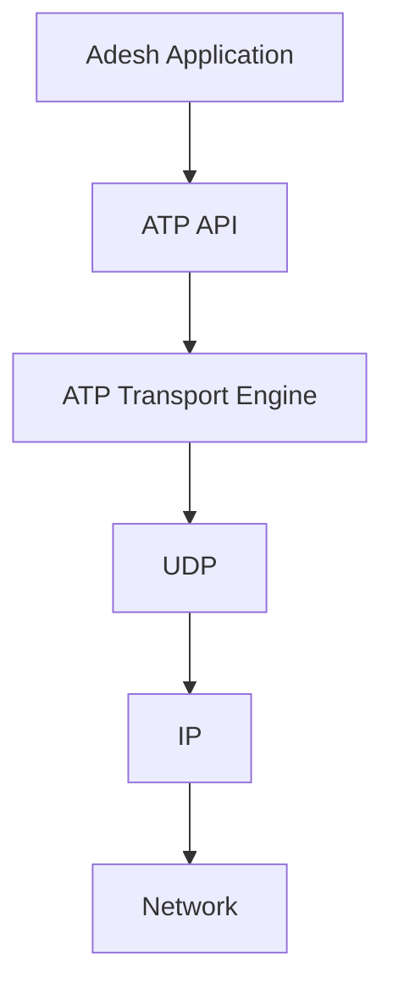

ATP is **not initially intended to replace UDP at the operating-system level**.

UDP is the initial carrier.

ATP supplies everything UDP does not:

```text
UDP
 └── Datagram delivery

ATP
 ├── Connections
 ├── Sessions
 ├── Streams
 ├── Messages
 ├── Reliability
 ├── Ordering
 ├── Fragmentation
 ├── Reassembly
 ├── ACKs
 ├── Loss detection
 ├── Flow control
 ├── Congestion control
 ├── Security
 ├── Replay protection
 ├── Connection migration
 ├── Memory management
 └── Application integration
```

---

# 2. Why ATP Exists

Traditional transport protocols make different trade-offs.

## TCP

TCP provides:

- reliability
- ordering
- congestion control
- flow control
- retransmission

But its abstraction is fundamentally:

```text
ordered byte stream
```

This creates limitations for applications that actually operate on independent messages.

For example:

```text
Message A
Message B
Message C
Message D
```

TCP doesn't inherently understand these boundaries.

It sees:

```text
A+B+C+D
```

If data associated with one logical operation is lost, the byte stream semantics force ordering behavior that may not match the application's needs.

---

# 3. Design Goals

ATP has the following primary goals.

## G1 — Low overhead

Minimize:

- packet header size
- redundant metadata
- ACK traffic
- memory allocations
- copies
- unnecessary retransmissions

---

## G2 — Selective reliability

Applications should decide whether a message needs reliability.

```text
Reliable
Unreliable
Reliable + unordered
Ordered
```

---

## G3 — Message orientation

ATP understands:

```text
Message
Fragment
Stream
Connection
```

rather than treating everything as one byte stream.

---

## G4 — Efficient fragmentation

Large application messages should be fragmented by ATP.

IP fragmentation should generally be avoided.

---

## G5 — Bounded memory

No remote peer should be able to force unlimited buffering.

Every connection and stream has memory limits.

---

## G6 — High performance

The implementation should support:

- buffer pools
- batching
- zero-copy where possible
- minimal allocation
- asynchronous I/O
- efficient timers
- efficient packet parsing
- lock minimization
- CPU-aware processing

---

## G7 — Security by default

Security is part of the protocol rather than an optional afterthought.

---

## G8 — Adesh-native architecture

ATP should exploit:

- Adesh ownership
- borrowing
- slices
- immutable buffers
- async execution
- runtime-managed resources

---

# 4. Non-Goals

ATP should **not** attempt to:

1. invent new cryptographic algorithms
2. guarantee zero latency
3. guarantee delivery on a broken network
4. eliminate congestion
5. magically eliminate all packet headers
6. be universally faster than TCP/QUIC
7. replace IP
8. immediately become an Internet-standard protocol

The objective is:

> Build a transport protocol optimized for a clearly defined set of workloads and prove its properties through testing and benchmarking.

---

# 5. Fundamental Design Principles

ATP follows twelve core principles.

### Principle 1 — Message first

```text
Application
    ↓
Message
    ↓
ATP
```

### Principle 2 — Reliability is a property of data

Not every message needs TCP-like reliability.

### Principle 3 — Ordering is local

Ordering should generally be per-stream or per-message group, not global.

### Principle 4 — Context should be reused

Don't repeat connection metadata unnecessarily.

### Principle 5 — Memory must be bounded

Every buffering operation has a budget.

### Principle 6 — Copies are expensive

Prefer references, slices and buffer ownership transfer.

### Principle 7 — Encryption is mandatory for secure sessions

### Principle 8 — Don't trust the peer

Every field is untrusted until validated.

### Principle 9 — Avoid IP fragmentation

ATP controls its own fragmentation.

### Principle 10 — Don't retransmit what doesn't matter

Unreliable data is allowed to disappear.

### Principle 11 — Congestion control is mandatory for Internet use

### Principle 12 — Complexity belongs in the runtime

The Adesh programmer should get a simple API.

---

# 6. ATP Architecture

The complete architecture:

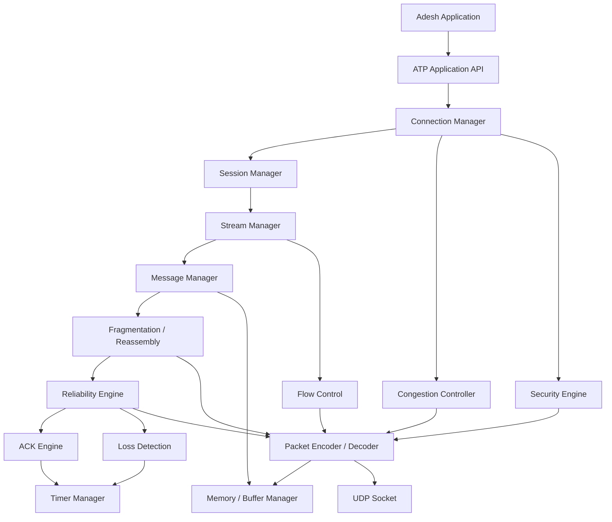

---

# 7. Protocol Layering

ATP is initially:

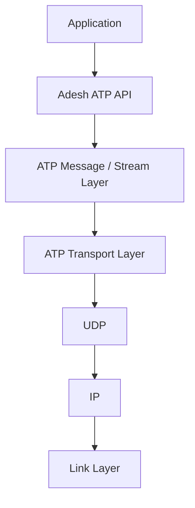

The important distinction is:

```text
UDP = packet carrier

ATP = transport semantics
```

---

# 8. Connection / Session / Stream / Message Model

ATP has four major logical levels.

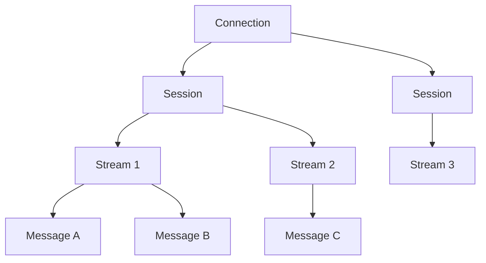

For the first ATP version, `Connection` and `Session` can share most implementation state.

The distinction becomes useful later for:

- reconnection
- migration
- resumable sessions
- authentication
- multiple logical sessions

---

# 9. ATP Packet Model

An ATP packet is the physical unit transmitted through UDP.

Conceptually:

```text
┌────────────────────────────────────────────┐
│ ATP Header                                 │
├────────────────────────────────────────────┤
│ Frame 1                                    │
├────────────────────────────────────────────┤
│ Frame 2                                    │
├────────────────────────────────────────────┤
│ Frame N                                    │
├────────────────────────────────────────────┤
│ Authentication Tag                        │
└────────────────────────────────────────────┘
```

A packet can contain multiple frames.

This is important.

Instead of:

```text
one UDP packet = one operation
```

ATP can aggregate:

```text
ACK
+
DATA
+
FLOW_UPDATE
+
PING
```

into one packet.

---

# 10. ATP Frame Model

Frames are logical objects inside ATP packets.

Possible frame types:

```text
0x01 CONNECTION_INIT
0x02 CONNECTION_INIT_ACK
0x03 HANDSHAKE
0x04 DATA
0x05 ACK
0x06 STREAM_OPEN
0x07 STREAM_CLOSE
0x08 STREAM_RESET
0x09 MAX_DATA
0x0A MAX_STREAM_DATA
0x0B PING
0x0C PONG
0x0D PATH_CHALLENGE
0x0E PATH_RESPONSE
0x0F CONNECTION_CLOSE
0x10 KEY_UPDATE
0x11 CANCEL
0x12 DATAGRAM
```

Future frame types can occupy additional ranges.

---

# 11. Packet Header Design

ATP should have two major header forms.

## 11.1 Long Header

Used during:

- connection establishment
- context creation
- exceptional control messages

Conceptual layout:

```text
┌────────┬────────┬──────────────┬──────────────┐
│ Flags  │ Type   │ Version      │ Connection ID│
├────────┴────────┴──────────────┴──────────────┤
│ Packet Number                                  │
├────────────────────────────────────────────────┤
│ Optional Context                               │
├────────────────────────────────────────────────┤
│ Payload                                        │
└────────────────────────────────────────────────┘
```

---

## 11.2 Short Header

Used for established connections.

```text
┌────────┬────────────┬──────────────┬───────────┐
│ Flags  │ Context ID │ Packet Number│ Payload   │
└────────┴────────────┴──────────────┴───────────┘
```

The exact field widths should remain configurable during experimentation.

---

# 12. Header Context Compression

This is one of ATP's central innovations.

Suppose a connection has:

```text
Connection ID = ABC123
Stream ID = 7
Message ID = 500
Security epoch = 4
```

The first packet can establish a context:

```text
CONTEXT 21

Connection = ABC123
Stream = 7
Message = 500
Security = 4
```

Subsequent packets only need:

```text
Context = 21
Fragment = N
```

Conceptually:

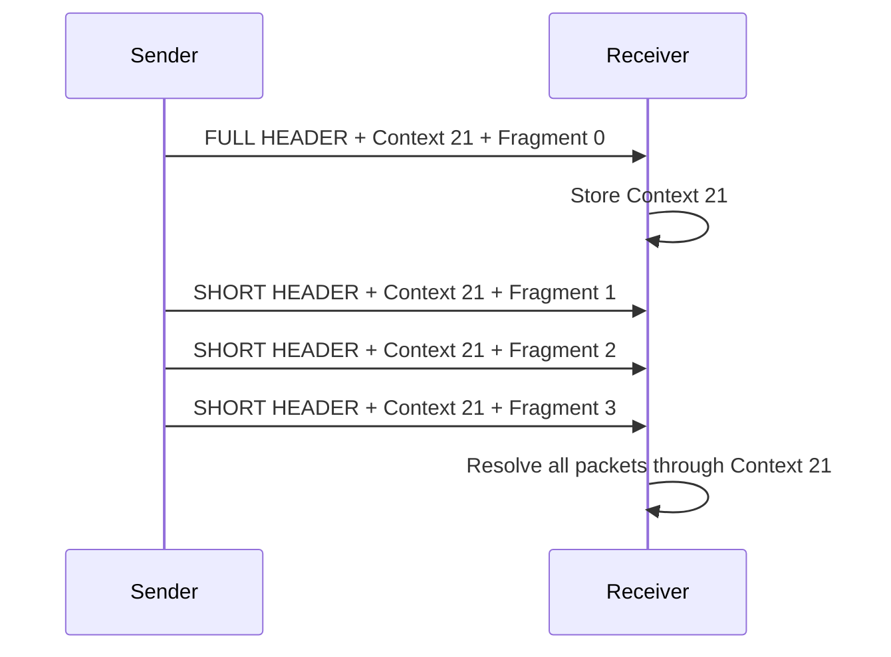

This attacks the repeated metadata problem directly.

---

# 13. Message Model

An ATP message contains:

```text
Message ID
Stream ID
Message Length
Reliability Mode
Ordering Mode
Fragment Information
Payload
```

A conceptual message:

```text
┌──────────────────────────────┐
│ Message ID                   │
│ Stream ID                    │
│ Total Length                 │
│ Reliability                  │
│ Ordering                     │
│ Flags                        │
│ Application Payload          │
└──────────────────────────────┘
```

---

# 14. Fragmentation and Reassembly

Suppose the application sends:

```text
10 MB message
```

ATP determines the safe packet payload size.

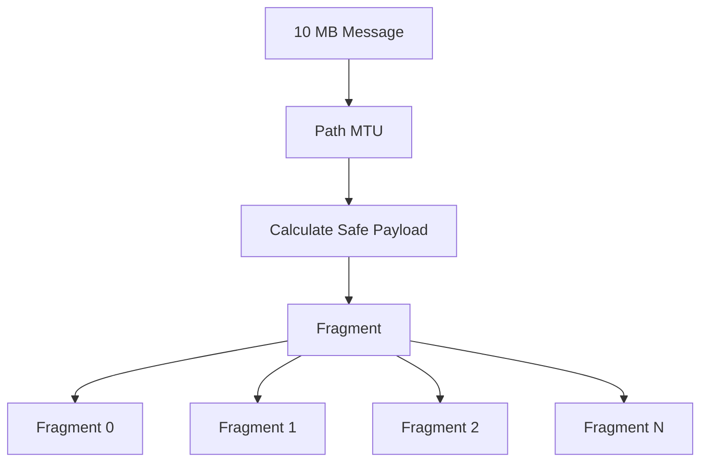

Each fragment logically contains:

```text
Context
Fragment Number
Payload
```

The receiver maintains reassembly state:

```text
Message 500

received:
0 ✓
1 ✓
2 ✗
3 ✓
4 ✓
```

It does not need to discard the entire message.

---

# 15. Sparse Reassembly

ATP should not allocate the complete message immediately.

Bad:

```text
10 MB message announced
       ↓
allocate 10 MB immediately
```

Better:

```text
Fragment arrives
      ↓
allocate buffer/chunk
      ↓
store fragment
```

For very large data:

```text
Message
│
├── Chunk 0
├── Chunk 1
├── Chunk 2
├── ...
└── Chunk N
```

Only received regions consume memory.

---

# 16. Reliability Model

ATP defines reliability as a message property.

### Reliable

```text
Must eventually arrive
```

subject to connection/network failure.

### Unreliable

```text
Best effort
```

No retransmission is required.

### Reliable unordered

```text
Must arrive
Order doesn't matter
```

### Ordered

```text
Must arrive in application-defined order
```

---

# 17. A Practical Reliability Matrix

| Mode | Delivery | Retransmit | Ordering |
|---|---|---|---|
| Unreliable | Best effort | No | No |
| Reliable | Yes | Yes | Optional |
| Reliable ordered | Yes | Yes | Yes |
| Reliable unordered | Yes | Yes | No |
| Ordered best-effort | Best effort | No | Yes |

This allows ATP to serve very different workloads.

---

# 18. Acknowledgement Model

ATP should use ACK ranges.

Example:

```text
Received:

1 2 3 4 5 7 8 9 12

ACK:

1-5
7-9
12
```

Conceptually:

```text
┌───────────────────────────────┐
│ Largest Packet: 12            │
│                               │
│ Range 1: 12-12                │
│ Range 2: 7-9                  │
│ Range 3: 1-5                  │
└───────────────────────────────┘
```

This is much more efficient than:

```text
ACK 1
ACK 2
ACK 3
ACK 4
...
```

---

# 19. ACK Aggregation

ATP should allow delayed ACKs.

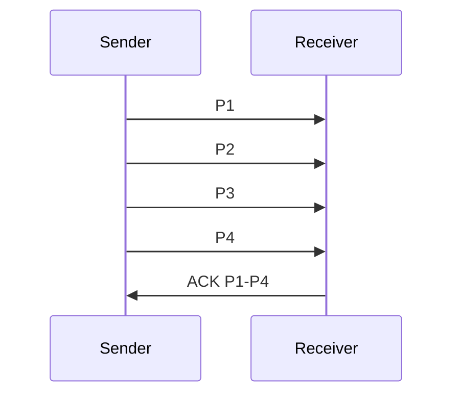

However, ACK delay must remain bounded.

The implementation should never wait indefinitely to save packets.

---

# 20. Loss Detection

ATP maintains packet state:

```text
SENT
  ↓
ACKED

or

SENT
  ↓
SUSPECTED_LOST
  ↓
RETRANSMIT
```

Packet tracking:

```text
Packet 100 → ACKED
Packet 101 → ACKED
Packet 102 → LOST
Packet 103 → ACKED
Packet 104 → ACKED
```

Only the data associated with packet 102 that still requires retransmission needs to be scheduled again.

---

# 21. Retransmission

ATP must distinguish:

```text
packet retransmission
```

from:

```text
data retransmission
```

The exact same encrypted packet should generally not simply be sent again.

Instead:

```text
Original:

DATA fragment 42
packet 100

Loss

New packet:

DATA fragment 42
packet 105
```

This provides fresh packet protection and avoids confusing packet identity with data identity.

---

# 22. Message-Level Retransmission

The reliability engine tracks:

```text
Message 100
 ├── Fragment 0 ACKED
 ├── Fragment 1 ACKED
 ├── Fragment 2 LOST
 └── Fragment 3 ACKED
```

Only:

```text
Fragment 2
```

needs retransmission.

This prevents retransmitting already-delivered data.

---

# 23. Ordering

ATP avoids global ordering.

Consider:

```text
Stream A
A1 A2 A3

Stream B
B1 B2 B3
```

Suppose A2 is lost.

ATP can still deliver:

```text
B1
B2
B3
```

without waiting for A2.

Within stream A:

```text
A1
   ↓
A2 missing
   ↓
A3 buffered
```

Depending on ordering mode, A3 may wait.

But Stream B is independent.

---

# 24. Multiplexing

One ATP connection can contain multiple streams.

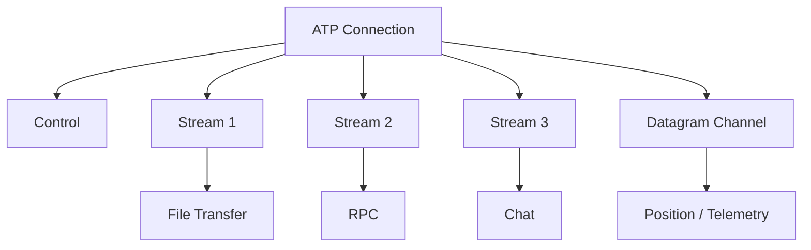

This means an application does not need:

```text
TCP connection 1
TCP connection 2
TCP connection 3
UDP socket
```

for every type of traffic.

---

# 25. Stream Isolation

Each stream has independent:

- sequence state
- flow-control state
- message state
- buffering
- cancellation
- priority

Conceptually:

```text
Connection
│
├── Stream 1
│   ├── send window
│   ├── receive window
│   └── messages
│
├── Stream 2
│   ├── send window
│   ├── receive window
│   └── messages
│
└── Stream 3
    ├── send window
    ├── receive window
    └── messages
```

---

# 26. Flow Control

ATP requires two levels.

## Connection-level

```text
Maximum connection receive data = 16 MB
```

## Stream-level

```text
Stream 1 = 4 MB
Stream 2 = 2 MB
Stream 3 = 1 MB
```

This prevents one stream from consuming all available memory.

---

# 27. Backpressure

The data flow should be:

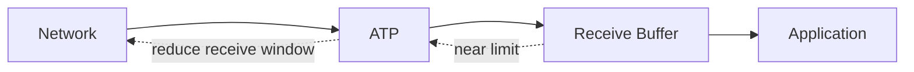

When the application stops consuming data:

```text
buffer usage
    ↓
50%
    ↓
75%
    ↓
90%
    ↓
backpressure
```

The protocol should reduce advertised receive capacity.

---

# 28. Memory Architecture

ATP should use bounded memory pools.

Instead of:

```text
packet arrives
   ↓
malloc
   ↓
parse
   ↓
copy
   ↓
free
```

prefer:

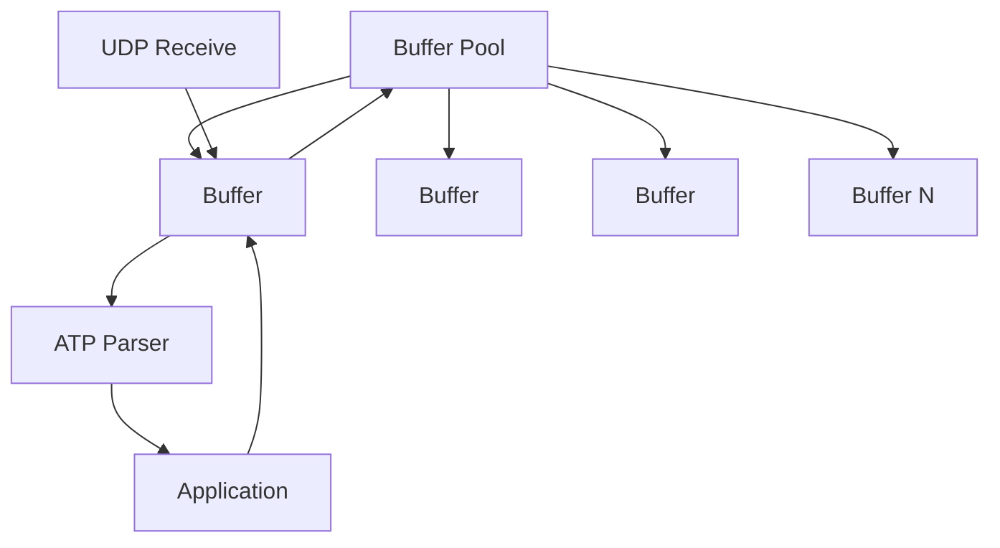

Buffers should be reused.

---

# 29. Memory Budgets

Each connection has a memory budget.

Example:

```text
Connection Budget: 16 MB

Control:              64 KB
Stream 1:              2 MB
Stream 2:              2 MB
Stream 3:              2 MB
Reassembly:            4 MB
Send Queue:            2 MB
Receive Queue:         2 MB
Internal State:        1 MB
Safety Reserve:        1 MB
```

The exact defaults should be configurable.

---

# 30. Memory Pressure

When memory becomes constrained:

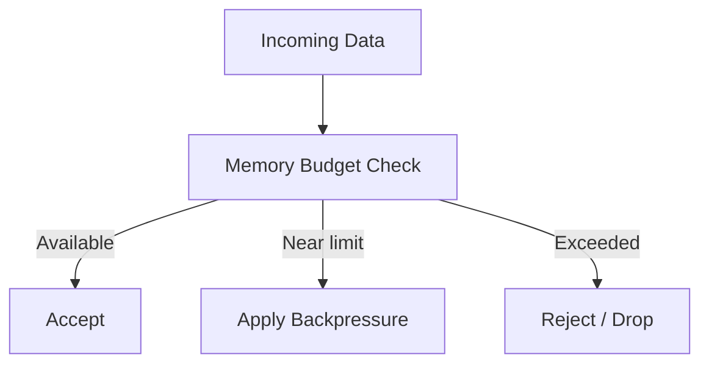

An attacker should never be able to say:

> "Allocate 10 GB because I declared a 10 GB message."

---

# 31. Zero-Copy Architecture

ATP should make zero-copy possible but not require it everywhere.

Conceptually:

```text
UDP receive buffer
       │
       ▼
ATP packet
       │
       ▼
payload slice
       │
       ▼
Adesh Bytes
       │
       ▼
Application
```

The ideal path:

```text
NIC
 ↓
OS socket buffer
 ↓
ATP buffer
 ↓
Adesh Bytes
```

rather than:

```text
NIC
 ↓
buffer A
 ↓ copy
buffer B
 ↓ copy
buffer C
 ↓ copy
application
```

---

# 32. Ownership Model

This is where AdeshLang can become particularly interesting.

An incoming buffer can have an ownership state:

```text
Owned
  ↓
Borrowed
  ↓
Consumed
```

For example:

```text
let data = message.bytes()
```

could return a borrowed view when safe.

If the application needs the data beyond the network buffer's lifetime:

```text
let owned = data.to_owned()
```

The language/runtime then makes the copy explicit.

---

# 33. Congestion Control

ATP cannot simply send as fast as the application requests.

Otherwise:

```text
Application
    ↓
100 GB/s
    ↓
Internet
    ↓
congestion
    ↓
packet loss
```

ATP needs a congestion controller.

Architecture:

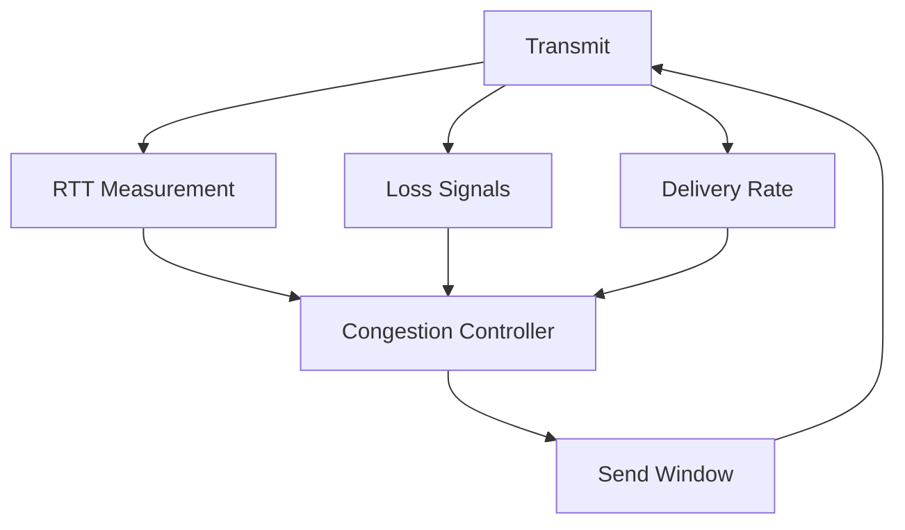

For the first implementation, use a well-understood congestion-control approach rather than inventing one.

The protocol can later experiment with alternatives.

---

# 34. Path MTU and Packet Sizing

ATP should avoid IP fragmentation.

The target is:

```text
Application Message
       ↓
ATP Fragmentation
       ↓
UDP Packet
       ↓
IP Packet
       ↓
Network
```

Not:

```text
ATP Packet
       ↓
IP Fragmentation
       ↓
multiple IP fragments
```

ATP should maintain a safe packet payload size based on:

- discovered MTU
- protocol overhead
- encryption overhead
- path changes

---

# 35. Connection Establishment

A conceptual handshake:

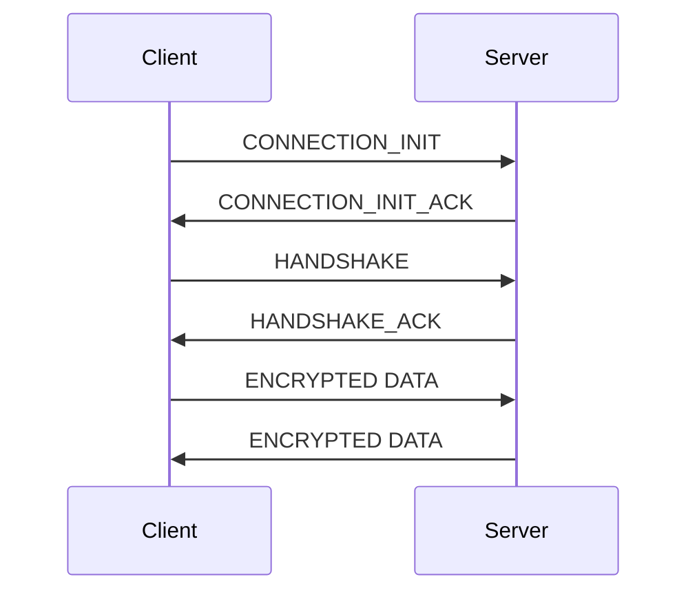

The handshake establishes:

```text
Connection ID
Protocol version
Capabilities
Security parameters
Initial flow-control limits
Initial stream limits
Transport parameters
```

---

# 36. Stateless Initial Validation

The server should avoid allocating expensive state for every unauthenticated packet.

Conceptually:

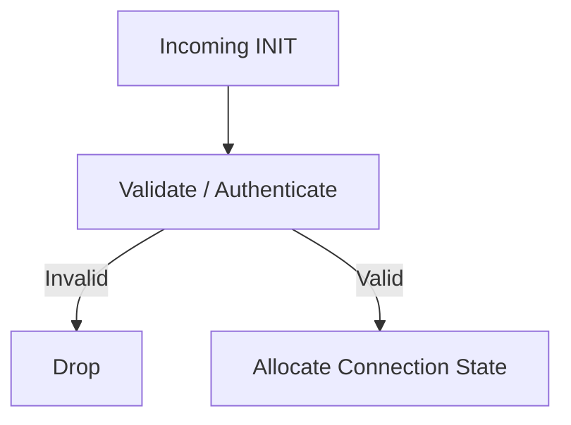

This is critical for DoS resistance.

---

# 37. Connection Migration

A connection should not necessarily depend permanently on:

```text
source IP + source port
```

Instead, ATP uses a logical connection identifier.

Example:

```text
Connection ID = 0x72A8...
```

The network path can change:

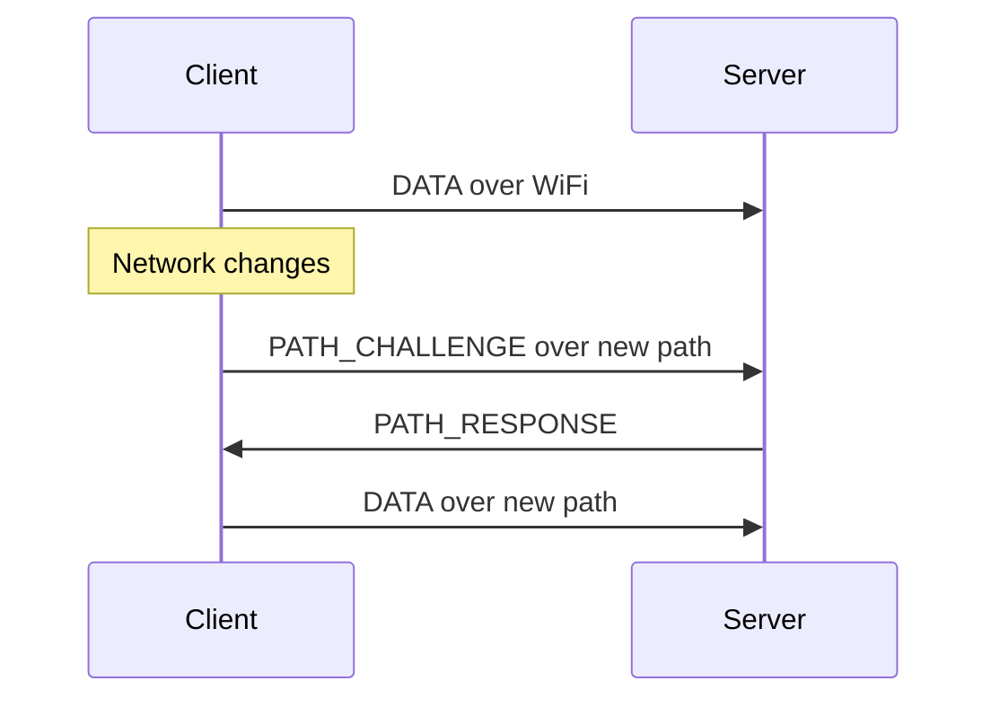

This allows future support for:

- WiFi → LTE
- LTE → WiFi
- IPv4 → IPv6 changes
- NAT rebinding

---

# 38. Security Architecture

Security should be layered:

```text
Connection Authentication
        ↓
Key Agreement
        ↓
Session Keys
        ↓
Packet Encryption
        ↓
Packet Authentication
        ↓
Replay Protection
```

ATP should **not invent its own encryption algorithm**.

The protocol design is new.

The cryptographic primitives should be established and independently reviewed.

---

# 39. Cryptographic Design

A conceptual secure handshake:

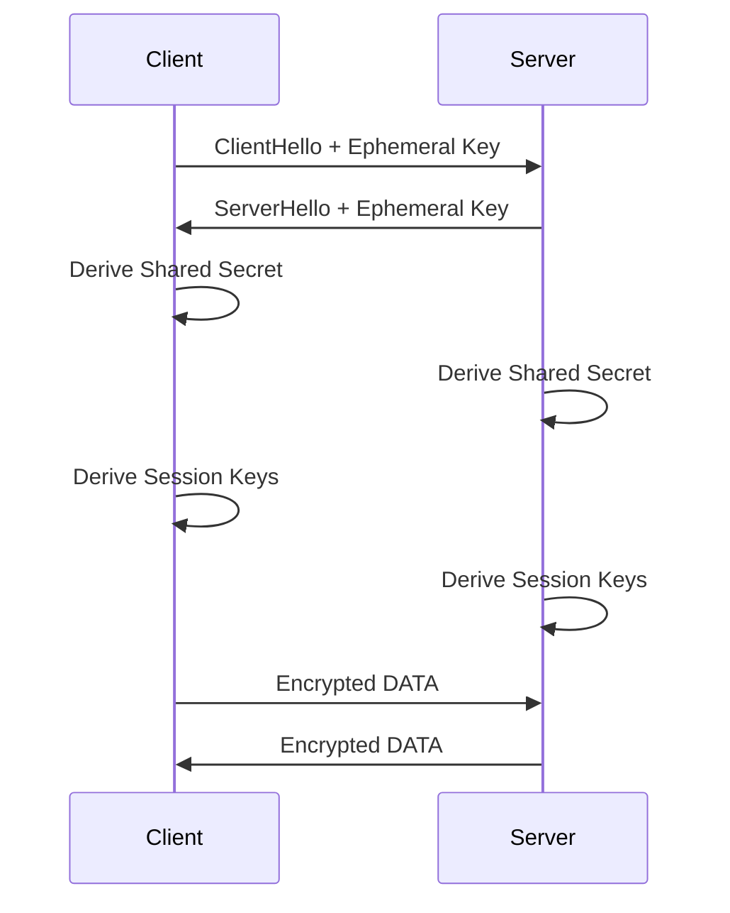

Potential primitives include:

```text
Key agreement:
X25519

Signatures:
Ed25519

Key derivation:
HKDF

Authenticated encryption:
ChaCha20-Poly1305
or
AES-GCM
```

The final primitive suite should be chosen after security analysis.

---

# 40. Packet Authentication

Encrypted packets need authenticated integrity.

Conceptually:

```text
Header
   +
Ciphertext
   ↓
AEAD
   ↓
Authentication Tag
```

Tampering:

```text
Attacker changes payload
        ↓
Authentication verification fails
        ↓
Packet rejected
```

---

# 41. Replay Protection

ATP maintains receive-side packet protection state.

Example:

```text
Received:

100
101
102
103
```

An old packet:

```text
101
```

arriving again can be rejected according to the packet-number/replay rules.

Replay protection must be designed carefully around:

- packet number spaces
- key epochs
- connection migration
- reordered packets
- handshake packets

---

# 42. Key Rotation

Keys should have epochs.

```text
Epoch 1
   │
   ├── packets
   ├── packets
   └── packets
        ↓
Epoch 2
   │
   ├── packets
   └── packets
```

The implementation must support overlap during transitions so packets aren't unnecessarily dropped during normal reordering.

---

# 43. DoS Protection

Threat:

```text
Attacker
   │
   ├── INIT
   ├── INIT
   ├── INIT
   ├── INIT
   └── INIT
          ↓
       Server
```

If every INIT causes:

```text
malloc
crypto setup
timer
connection state
buffer allocation
```

the server can be exhausted.

Therefore:

```text
cheap validation
      ↓
stateless validation
      ↓
only then expensive state
```

---

# 44. Connection Lifecycle

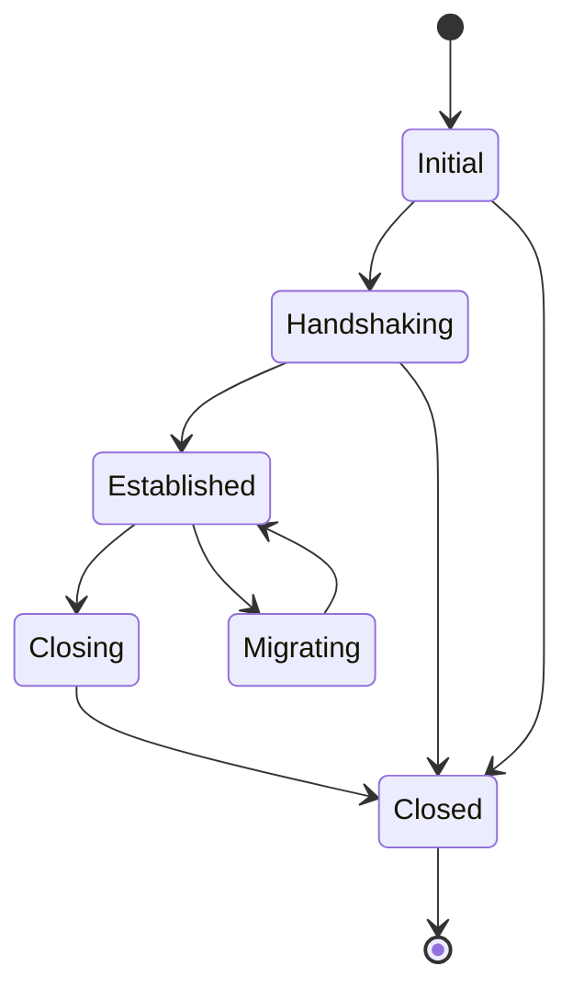

---

# 45. Packet Processing Pipeline

Receive path:


Important:

**Authentication should happen before trusting sensitive frame fields.**

---

# 46. Transmit Pipeline


The scheduler decides:

```text
What should be sent?
Which stream?
Which priority?
Which message?
Which retransmission?
How much congestion window is available?
```

---

# 47. Scheduler

ATP should not simply process:

```text
Stream 1 completely
then Stream 2
then Stream 3
```

That can cause starvation.

Instead:

```text
Priority
+
Fairness
+
Congestion window
+
Deadline
+
Retransmission urgency
```

can influence scheduling.

Example:

```text
Priority 10 → control
Priority 7  → RPC
Priority 5  → file
Priority 1  → telemetry
```

---

# 48. Timer Architecture

Do not create an operating-system timer for every packet.

ATP can use a timer wheel:

```text
Timer Wheel

[0][1][2][3][4][5][6][7][8][9]...
       ↑
    current tick
```

Timers include:

```text
ACK timeout
Retransmission timeout
Handshake timeout
Idle timeout
Keepalive
Path validation
Key update
Connection timeout
```

A timer wheel can scale better than creating huge numbers of individual timer objects.

---

# 49. AdeshLang Integration

ATP should be a first-class networking capability.

Possible package:

```text
std:net
std:net:udp
std:net:atp
```

Conceptually:

```text
std:net
 ├── Address
 ├── Socket
 ├── Bytes
 └── Error

std:net:udp
 └── UDP

std:net:atp
 ├── Connection
 ├── Stream
 ├── Message
 ├── Datagram
 └── Server
```

---

# 50. Adesh API

A high-level API could look like:

```adesh
let server = atp.listen("0.0.0.0:9000")

let connection = await server.accept()

await connection.send(
    data,
    reliable: true
)

let message = await connection.receive()
```

---

# 51. Unreliable Data

```adesh
await connection.send(
    position,
    reliable: false
)
```

This allows ATP to transport data that doesn't need retransmission.

Example:

```text
Player position:
100,200
101,200
102,201
103,202
```

If position `101,200` is lost, retransmitting it later might be useless because newer state exists.

---

# 52. Reliable Data

```adesh
await connection.send(
    payment_request,
    reliable: true
)
```

For important operations:

```text
request
  ↓
ACK
  ↓
confirmation
```

---

# 53. Streams

```adesh
let stream = await connection.open_stream()

await stream.send(data)

let response = await stream.receive()
```

Different streams can operate concurrently.

---

# 54. Datagram API

ATP can expose an explicit datagram mode:

```adesh
connection.datagram.send(data)
```

This maps to:

```text
ATP DATAGRAM
```

rather than pretending all traffic is reliable.

---

# 55. File Transfer

A future high-level API:

```adesh
await connection.send_file(
    "video.mp4",
    reliable: true
)
```

The transport can internally use:

```text
file
 ↓
chunks
 ↓
messages
 ↓
fragments
 ↓
ATP packets
```

---

# 56. Error Model

ATP should distinguish:

```text
TransportError
ProtocolError
SecurityError
ConnectionError
StreamError
MessageError
TimeoutError
MemoryError
ApplicationError
```

Examples:

```text
ConnectionClosed
HandshakeFailed
InvalidPacket
AuthenticationFailed
FlowControlExceeded
MessageTooLarge
StreamLimitExceeded
MemoryLimitExceeded
PathValidationFailed
```

---

# 57. Protocol Invariants

These should be treated as hard correctness rules.

### Invariant 1

An unauthenticated packet must not modify trusted connection state.

### Invariant 2

A peer cannot allocate unbounded memory remotely.

### Invariant 3

A packet number cannot be reused within the same packet-number/security context.

### Invariant 4

A fragment cannot be accepted outside its valid message context.

### Invariant 5

A stream cannot exceed its receive/send limits.

### Invariant 6

An unreliable message must never enter an unbounded retransmission queue.

### Invariant 7

Congestion control must limit network transmission.

### Invariant 8

Decryption/authentication must happen before trusting protected frame contents.

### Invariant 9

Fragmentation must respect the current path packet-size limit.

### Invariant 10

Connection teardown must release all associated resources.

---

# 58. Wire-Level Example — Small Message

Application:

```text
"hello"
```

ATP might construct:

```text
DATA FRAME

Stream ID: 4
Message ID: 100
Flags: RELIABLE | FIN
Length: 5

Payload:
hello
```

Then encrypt and transmit:

```text
┌───────────────────────────────┐
│ Short ATP Header              │
├───────────────────────────────┤
│ Encrypted DATA Frame          │
│                               │
│ Stream = 4                    │
│ Message = 100                 │
│ Payload = hello               │
├───────────────────────────────┤
│ Authentication Tag            │
└───────────────────────────────┘
```

---

# 59. Wire-Level Example — Large Message

Application sends:

```text
10 MB
```

ATP creates:

```text
Message 900
```

Fragments:

```text
900/0
900/1
900/2
...
900/N
```

Initial packet:

```text
FULL HEADER
Context = 21
Message = 900
Fragment = 0
```

Later packets:

```text
SHORT HEADER
Context = 21
Fragment = 1
```

```text
SHORT HEADER
Context = 21
Fragment = 2
```

```text
SHORT HEADER
Context = 21
Fragment = 3
```

This is the basic mechanism for reducing repetitive metadata.

---

# 60. Wire-Level Example — Packet Loss

Sender:

```text
Fragment 0
Fragment 1
Fragment 2
Fragment 3
```

Network:

```text
0 ✓
1 ✓
2 ✗
3 ✓
```

Receiver ACK:

```text
Received:
0-1
3
```

Sender determines:

```text
Fragment 2 missing
```

Retransmits only:

```text
Fragment 2
```

---

# 61. Wire-Level Example — Mixed Reliability

One connection:

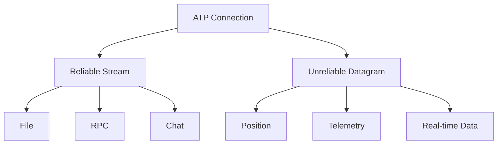

This is one of ATP's central differences from a pure TCP abstraction.

---

# 62. Complete Data Flow

```mermaid
sequenceDiagram

    participant A as Adesh App
    participant E as ATP Engine
    participant U as UDP
    participant N as Network
    participant R as Remote ATP
    participant B as Remote App

    A->>E: send(message)
    E->>E: assign Message ID
    E->>E: select reliability
    E->>E: fragment
    E->>E: schedule
    E->>E: encrypt
    E->>U: UDP packet
    U->>N: transmit
    N->>R: packet
    R->>R: authenticate
    R->>R: decrypt
    R->>R: parse
    R->>R: reassemble
    R->>B: deliver message
    R->>N: ACK
    N->>U: ACK
    U->>E: ACK
    E->>E: mark fragments delivered
```

---

# 63. Complete ATP Architecture

```mermaid
flowchart TB

    APP["Adesh Application"]

    API["ATP API"]

    subgraph ATP["ATP Runtime"]

        CONN["Connection Manager"]

        SEC["Security"]

        STREAM["Stream Manager"]

        MSG["Message Manager"]

        FRAG["Fragmentation"]

        REL["Reliability"]

        ACK["ACK Engine"]

        LOSS["Loss Detection"]

        FLOW["Flow Control"]

        CONG["Congestion Control"]

        SCHED["Scheduler"]

        MEM["Memory Manager"]

        BUF["Buffer Pool"]

        TIMER["Timer Wheel"]

        CODEC["Packet Codec"]

    end

    UDP["UDP"]
    IP["IP"]
    NET["Network"]

    APP --> API
    API --> CONN

    CONN --> SEC
    CONN --> STREAM

    STREAM --> MSG
    MSG --> FRAG
    FRAG --> REL

    REL --> ACK
    REL --> LOSS

    STREAM --> FLOW
    CONN --> CONG

    MSG --> SCHED
    REL --> SCHED

    SCHED --> MEM
    MEM --> BUF

    LOSS --> TIMER
    ACK --> TIMER

    SCHED --> CODEC
    SEC --> CODEC

    CODEC --> UDP
    UDP --> IP
    IP --> NET
```

---

# 64. How ATP Differs From TCP

## TCP

```text
Application
    ↓
TCP
    ↓
Byte stream
```

ATP:

```text
Application
    ↓
ATP
    ↓
Messages
    ↓
Fragments
```

### TCP characteristics

```text
Reliable
Ordered
Byte stream
One primary delivery semantic
```

### ATP

```text
Reliable
Unreliable
Ordered
Unordered
Message-oriented
Multiplexed
```

---

# 65. TCP Head-of-Line Problem

TCP:

```text
A1
A2 LOST
A3
A4
```

The byte stream cannot simply expose:

```text
A1
A3
A4
```

because A2 is missing.

ATP can have:

```text
Stream A:
A1
A2 LOST
A3

Stream B:
B1
B2
B3
```

and still deliver Stream B.

---

# 66. TCP Header Repetition

ATP doesn't eliminate all packet headers.

That would be unrealistic.

Instead it reduces **logical metadata repetition**.

TCP:

```text
Packet
└── TCP header
```

ATP:

```text
First packet:
Full context

Later packets:
Compact context reference
```

So the optimization is:

```text
repeat metadata
       ↓
establish context
       ↓
reference context
```

---

# 67. How ATP Differs From UDP

UDP gives:

```text
Datagram
```

ATP provides:

```text
Connection
Session
Stream
Message
Fragmentation
Reliability
ACK
Retransmission
Flow control
Congestion control
Security
Memory limits
```

Therefore:

```text
UDP = primitive
ATP = transport system
```

---

# 68. How ATP Differs From QUIC

QUIC is the most important comparison.

ATP should **not claim superiority simply because it is newer**.

QUIC already solves many difficult problems:

```text
Encryption
Multiplexing
Loss recovery
Congestion control
Streams
Connection migration
0/1 RTT establishment
```

ATP therefore needs a genuine differentiation.

The strongest proposed differences are:

### ATP Difference 1 — Message-first design

QUIC's primary abstraction is stream-oriented.

ATP makes messages first-class.

```text
ATP:

Connection
 ├── Stream
 │    ├── Message
 │    ├── Message
 │    └── Message
 └── Datagram
```

---

### ATP Difference 2 — Message-level reliability

ATP explicitly attaches reliability semantics to messages.

```text
Message A → reliable
Message B → unreliable
Message C → reliable unordered
```

---

### ATP Difference 3 — Context-compressed metadata

ATP can explicitly model transport contexts:

```text
Context 21
 ↓
Connection
 ↓
Stream
 ↓
Message
 ↓
Security Epoch
```

Continuation packets can reference that context.

---

### ATP Difference 4 — Adesh-native memory model

QUIC implementations are general-purpose.

ATP can be designed around Adesh's:

```text
ownership
borrowing
slices
buffer pools
async runtime
```

This is potentially a major implementation advantage.

---

### ATP Difference 5 — Explicit memory budgeting

ATP can make memory limits a first-class transport concept:

```text
connection.memory_limit
stream.memory_limit
reassembly.memory_limit
```

---

### ATP Difference 6 — Runtime-level zero-copy

Because ATP and the Adesh runtime are being designed together:

```text
ATP Buffer
   ↓
Adesh Bytes
```

can potentially avoid unnecessary conversions.

---

# 69. ATP vs TCP vs UDP vs QUIC

| Capability | TCP | UDP | QUIC | ATP |
|---|---:|---:|---:|---:|
| Reliable | Yes | No | Yes | Yes |
| Unreliable | No | Yes | Via datagram extensions | Yes |
| Message-oriented | No | Yes | Partially | **Yes** |
| Multiplexing | No | No | Yes | **Yes** |
| Selective reliability | No | No | Limited/application-dependent | **Yes** |
| Ordered streams | Yes | No | Yes | Yes |
| Unordered reliable data | No | No | Possible | **Native goal** |
| Application fragmentation | No | No | Yes | **Yes** |
| Context compression | Limited | N/A | Yes | **Core concept** |
| Encryption | External | External | Built-in | **Built-in** |
| Flow control | Yes | No | Yes | Yes |
| Congestion control | Yes | No | Yes | Yes |
| Connection migration | No | No | Yes | Yes |
| Bounded memory model | Implementation | Implementation | Implementation | **Protocol goal** |
| Adesh ownership integration | No | No | No | **Yes** |
| Adesh zero-copy integration | No | No | No | **Yes** |

---

# 70. What ATP Does Not Magically Solve

This is extremely important.

A new protocol cannot simultaneously have:

```text
zero overhead
+
perfect reliability
+
zero latency
+
unlimited throughput
+
zero memory
+
perfect security
```

Those properties conflict.

For example:

### Reliability costs bandwidth

```text
lost packet
 ↓
ACK
 ↓
retransmission
 ↓
additional bandwidth
```

### Security costs CPU

```text
encryption
 ↓
authentication
 ↓
CPU work
```

### Fragmentation costs metadata

```text
large message
 ↓
many fragments
 ↓
fragment identifiers
```

### Multiplexing costs state

```text
more streams
 ↓
more state
```

The goal of ATP is therefore:

> **Make trade-offs explicit and optimize them intelligently rather than pretending the trade-offs don't exist.**

---

# 71. ATP Performance Strategy

Performance should be attacked at multiple levels.

## Level 1 — Wire efficiency

Reduce:

```text
header bytes
ACK bytes
duplicate metadata
unnecessary retransmission
```

---

## Level 2 — CPU efficiency

Reduce:

```text
allocations
copies
locks
syscalls
packet parsing overhead
```

---

## Level 3 — Memory efficiency

Use:

```text
buffer pools
bounded queues
slices
ownership transfer
lazy allocation
chunked reassembly
```

---

## Level 4 — Network efficiency

Use:

```text
congestion control
adaptive packet sizing
selective retransmission
ACK aggregation
```

---

# 72. Packet Batching

Instead of:

```text
syscall
packet
syscall
packet
syscall
packet
```

prefer batching where the OS/runtime allows it:

```text
syscall
 ├── packet 1
 ├── packet 2
 ├── packet 3
 ├── packet 4
 └── packet 5
```

This can significantly reduce syscall overhead.

---

# 73. Allocation Strategy

Avoid:

```text
new packet object
new frame object
new fragment object
new buffer
```

for every packet.

Prefer:

```text
Pool
 ├── packet buffers
 ├── frame metadata
 ├── fragment descriptors
 └── connection objects
```

---

# 74. Data Structures

Potential runtime structures:

```text
ATPConnection
ATPStream
ATPMessage
ATPFragment
ATPContext
ATPPacket
ATPFrame
ACKRange
SendBuffer
ReceiveBuffer
TimerEntry
SecurityContext
CongestionState
```

A fragment should preferably reference a buffer region:

```text
Fragment
 ├── buffer reference
 ├── offset
 ├── length
 ├── message ID
 └── fragment ID
```

rather than owning another copy of the payload.

---

# 75. Reassembly Data Structure

Possible conceptual structure:

```text
MessageReassembly

Message ID
Total Length
Received Length
Fragment Map
Memory Used
Deadline
State
```

Fragment map:

```text
0-1199
2400-3599
3600-4799
```

Missing:

```text
1200-2399
```

This enables selective recovery.

---

# 76. Cancellation

Applications should be able to cancel messages.

```adesh
let operation = connection.send(data, reliable: true)

operation.cancel()
```

ATP can then remove:

```text
queued fragments
retransmission state
reassembly state
```

instead of continuing to send useless data.

---

# 77. Deadlines

Future ATP versions should support:

```adesh
connection.send(
    data,
    reliable: true,
    deadline: 500.ms
)
```

If a message becomes irrelevant after the deadline:

```text
deadline reached
       ↓
cancel retransmission
       ↓
free memory
```

This is particularly useful for real-time systems.

---

# 78. Priority

Messages can have priorities.

```text
CONTROL     = highest
RPC         = high
CHAT        = medium
FILE        = low
TELEMETRY   = low
```

The scheduler uses these priorities while still maintaining fairness.

---

# 79. Expiring Unreliable Data

An especially useful optimization:

```text
position update #100
position update #101
position update #102
```

If #102 has already been sent successfully:

```text
#100 → obsolete
#101 → obsolete
```

ATP can potentially discard stale queued updates.

This is a **semantic optimization** that a generic byte-stream transport cannot safely perform.

---

# 80. Application Semantics vs Transport Semantics

ATP should not attempt to understand arbitrary application meaning.

Instead, the API can expose hints:

```text
priority
deadline
reliability
ordering
idempotency
```

The application remains responsible for business semantics.

---

# 81. Security Threat Model

ATP must assume:

```text
Peer is malicious
Network is malicious
Packets can be:

duplicated
modified
delayed
reordered
dropped
replayed
injected
```

Potential attacks:

```text
Memory exhaustion
CPU exhaustion
Connection flooding
Fragment flooding
ACK flooding
Replay
Packet injection
Handshake amplification
Stream exhaustion
State exhaustion
Malformed packet attacks
```

---

# 82. Fragment Flood Attack

Attacker sends:

```text
Message 1 fragment 0
Message 2 fragment 0
Message 3 fragment 0
...
Message 1,000,000 fragment 0
```

Naive implementation:

```text
allocate state for every message
```

ATP:

```text
per-peer message limit
+
reassembly memory limit
+
connection limit
+
expiration
```

Then:

```text
limit exceeded
 ↓
drop / reject
```

---

# 83. CPU Exhaustion

An attacker might send packets that are expensive to process.

Therefore:

```text
cheap validation
 ↓
cheap structural parsing
 ↓
authentication
 ↓
expensive processing
```

should be the general pattern.

---

# 84. Amplification Protection

A server should not respond with:

```text
1 KB request
↓
1 MB response
```

before proving the requester can receive traffic.

ATP should include mechanisms for:

- address validation
- response limiting
- handshake amplification control

---

# 85. Version Negotiation

Packets should identify the protocol version.

Conceptually:

```text
ATP Version = 1
```

If a peer doesn't support it:

```text
VERSION_NEGOTIATION
```

This prevents future protocol evolution from becoming impossible.

---

# 86. Extension Framework

Frames should have extensibility.

Conceptually:

```text
Core Frames
 ├── DATA
 ├── ACK
 ├── FLOW
 └── CLOSE

Extension Frames
 ├── FILE_HINT
 ├── DEADLINE
 ├── FEC
 ├── MULTIPATH
 └── CUSTOM
```

Unknown optional frames should be safely ignored when appropriate.

Critical frames should trigger protocol errors if unsupported.

---

# 87. Forward Compatibility

Reserve:

```text
version bits
frame types
flag bits
extension identifiers
```

from the beginning.

Do not consume every bit because it looks convenient.

---

# 88. Protocol State Machine

A connection can be represented as:

```mermaid
stateDiagram-v2

    [*] --> INITIAL

    INITIAL --> HANDSHAKING : INIT
    HANDSHAKING --> ESTABLISHED : handshake success

    ESTABLISHED --> ESTABLISHED : DATA
    ESTABLISHED --> MIGRATING : path change
    MIGRATING --> ESTABLISHED : path validated

    ESTABLISHED --> CLOSING : close requested
    CLOSING --> CLOSED : close complete

    INITIAL --> CLOSED : timeout
    HANDSHAKING --> CLOSED : failure
    ESTABLISHED --> CLOSED : fatal error

    CLOSED --> [*]
```

---

# 89. Stream State Machine

```mermaid
stateDiagram-v2

    [*] --> IDLE
    IDLE --> OPENING
    OPENING --> OPEN
    OPEN --> HALF_CLOSED_LOCAL
    OPEN --> HALF_CLOSED_REMOTE
    HALF_CLOSED_LOCAL --> CLOSED
    HALF_CLOSED_REMOTE --> CLOSED
    OPEN --> RESET
    RESET --> CLOSED
    CLOSED --> [*]
```

---

# 90. Message State Machine

```mermaid
stateDiagram-v2

    [*] --> QUEUED
    QUEUED --> SENT
    SENT --> PARTIALLY_ACKED
    PARTIALLY_ACKED --> SENT
    PARTIALLY_ACKED --> COMPLETE
    SENT --> COMPLETE
    QUEUED --> CANCELLED
    SENT --> EXPIRED
    PARTIALLY_ACKED --> EXPIRED
    COMPLETE --> [*]
    CANCELLED --> [*]
    EXPIRED --> [*]
```

---

# 91. ATP Internal Modules

Recommended implementation layout:

```text
atp/
│
├── packet/
│   ├── encode
│   ├── decode
│   ├── header
│   └── frame
│
├── connection/
│   ├── state
│   ├── handshake
│   ├── migration
│   └── lifecycle
│
├── stream/
│   ├── stream
│   ├── scheduler
│   └── flow_control
│
├── message/
│   ├── message
│   ├── fragment
│   └── reassembly
│
├── reliability/
│   ├── ack
│   ├── loss
│   └── retransmission
│
├── congestion/
│   └── controller
│
├── security/
│   ├── handshake
│   ├── keys
│   ├── crypto
│   └── replay
│
├── memory/
│   ├── pool
│   ├── buffer
│   └── budget
│
├── timer/
│   └── wheel
│
└── api/
    ├── connection
    ├── stream
    └── message
```

---

# 92. Implementation Phase 0 — Specification

Before coding:

```text
Define:

packet format
frame format
state machines
error codes
limits
security model
memory model
```

Create:

```text
ATP_SPEC.md
ATP_WIRE_FORMAT.md
ATP_SECURITY.md
ATP_STATE_MACHINE.md
```

---

# 93. Implementation Phase 1 — Packet Engine

Implement:

```text
encode packet
decode packet
encode frame
decode frame
flags
version
connection ID
packet number
```

No reliability yet.

Goal:

```text
Adesh
 ↓
ATP packet
 ↓
UDP
 ↓
ATP packet
 ↓
Adesh
```

---

# 94. Implementation Phase 2 — Connection

Implement:

```text
connection IDs
connection lifecycle
INIT
INIT_ACK
CLOSE
PING
PONG
```

Goal:

```text
connect()
accept()
close()
```

---

# 95. Implementation Phase 3 — Messages

Implement:

```text
Message ID
DATA frame
message boundaries
basic fragmentation
reassembly
```

Goal:

```text
send(message)
receive(message)
```

---

# 96. Implementation Phase 4 — Reliability

Implement:

```text
packet numbers
ACK
ACK ranges
loss detection
retransmission
duplicate detection
```

Goal:

```text
Reliable messages survive packet loss.
```

---

# 97. Implementation Phase 5 — Streams

Implement:

```text
stream IDs
stream lifecycle
per-stream queues
stream ordering
stream flow control
```

---

# 98. Implementation Phase 6 — Memory

Implement:

```text
buffer pool
memory budgets
reassembly limits
send limits
receive limits
backpressure
```

Then benchmark memory per connection.

---

# 99. Implementation Phase 7 — Performance

Implement:

```text
batching
zero-copy paths
reduced allocation
timer wheel
efficient packet parsing
scheduler
```

---

# 100. Implementation Phase 8 — Congestion Control

Implement a proven baseline.

Then measure:

```text
throughput
RTT
loss
fairness
recovery
```

Only after this should experimental algorithms be introduced.

---

# 101. Implementation Phase 9 — Security

Implement:

```text
secure handshake
key agreement
AEAD
key derivation
replay protection
key rotation
DoS protection
```

Security should be tested independently from transport correctness.

---

# 102. Implementation Phase 10 — Adesh Integration

Expose:

```text
std:net:atp
```

with:

```text
AtpServer
AtpConnection
AtpStream
AtpMessage
AtpDatagram
AtpError
```

---

# 103. Testing Strategy

Testing must happen at multiple levels.

## Unit Tests

```text
packet encoder
packet decoder
frame parser
fragmentation
reassembly
ACK ranges
sequence tracking
memory budget
state machine
```

---

# 104. Property Tests

Generate random:

```text
packet sequences
fragment ordering
packet loss
duplicates
reordering
delays
malformed fields
```

Expected invariant:

```text
No panic
No memory leak
No invalid state
No unsafe memory access
```

---

# 105. Network Simulation

Build a network simulator capable of:

```text
0% loss
1% loss
5% loss
10% loss

packet reorder
packet duplication
variable RTT
bandwidth limitation
bursty loss
```

---

# 106. Example Simulation

```mermaid
flowchart LR

    S["ATP Sender"]

    SIM["Network Simulator"]

    R["ATP Receiver"]

    S --> SIM
    SIM --> R

    SIM --> L["Loss"]
    SIM --> D["Delay"]
    SIM --> O["Reordering"]
    SIM --> DUP["Duplication"]

    L --> SIM
    D --> SIM
    O --> SIM
    DUP --> SIM
```

---

# 107. Fuzzing

The packet decoder is security-critical.

Fuzz:

```text
random bytes
truncated packets
oversized lengths
invalid frame types
invalid flags
invalid packet numbers
invalid contexts
invalid fragment offsets
```

The decoder must never:

```text
panic
overflow
underflow
allocate unbounded memory
access invalid memory
```

---

# 108. Benchmarking

Compare:

```text
UDP
TCP
QUIC
ATP
```

under the same conditions.

Measure:

### Throughput

```text
MB/s
Gb/s
```

### Latency

```text
p50
p95
p99
```

### CPU

```text
CPU %
cycles/byte
cycles/packet
```

### Memory

```text
bytes/connection
bytes/message
bytes/stream
```

### Network overhead

```text
header bytes
ACK bytes
retransmitted bytes
total bytes
```

---

# 109. Benchmark Scenarios

### Scenario A — Small messages

```text
64 bytes
256 bytes
1 KB
```

### Scenario B — Medium messages

```text
16 KB
64 KB
1 MB
```

### Scenario C — Large messages

```text
10 MB
100 MB
1 GB
```

### Scenario D — Many connections

```text
1
100
1,000
10,000
100,000
```

depending on system capabilities.

---

# 110. Benchmark Scenarios — Loss

Test:

```text
0%
0.1%
1%
5%
10%
20%
```

with:

```text
low RTT
high RTT
```

---

# 111. Benchmark Scenarios — Multiplexing

Compare:

```text
100 independent TCP connections
```

against:

```text
1 ATP connection
100 streams
```

Measure:

```text
memory
CPU
latency
throughput
```

---

# 112. Security Testing

Test:

```text
packet injection
replay
tampering
handshake flooding
fragment flooding
stream flooding
memory exhaustion
CPU exhaustion
invalid cryptographic state
key transitions
```

---

# 113. Formalization Roadmap

Once ATP works:

```text
Prototype
   ↓
Specification
   ↓
Reference implementation
   ↓
Property tests
   ↓
Fuzzing
   ↓
Threat model
   ↓
Independent review
   ↓
Interoperability
   ↓
Benchmark
```

Only then should claims such as:

```text
"ATP is more secure"
```

or:

```text
"ATP is faster"
```

be made.

---

# 114. Reference Implementation Philosophy

The first ATP implementation should prioritize:

```text
correctness
clarity
testability
```

not maximum performance.

Architecture:

```text
ATP Reference Implementation
           │
           ├── easy to inspect
           ├── heavily tested
           └── specification-compliant
```

Then create optimized implementations later.

---

# 115. Debug Mode

ATP should have a protocol diagnostic mode.

Example:

```text
ATP TRACE

CONNECTION 42
  State: ESTABLISHED

PACKET 109
  Context: 17
  Stream: 4
  Message: 900
  Fragment: 8
  Size: 1180
  Encrypted: true

PACKET 110
  ACK: 107-109

PACKET 111
  LOSS: fragment 7

PACKET 112
  RETRANSMIT: fragment 7
```

This would make development dramatically easier.

---

# 116. Metrics

ATP should expose:

```text
packets_sent
packets_received
packets_lost
packets_retransmitted

bytes_sent
bytes_received
bytes_retransmitted

rtt
min_rtt
max_rtt

cwnd
send_window
receive_window

memory_used
memory_limit

streams_open
messages_pending
```

---

# 117. Why This Could Be Especially Good for AdeshLang

The biggest opportunity is not:

> "Adesh invented a protocol."

The bigger opportunity is:

> **Adesh's programming language and transport runtime are designed together.**

That creates a stack like:

```mermaid
flowchart TB

    LANGUAGE["Adesh Language"]

    OWNERSHIP["Ownership / Borrowing"]

    ASYNC["Async Runtime"]

    BYTES["Bytes / Buffer Model"]

    ATP["ATP"]

    UDP["UDP"]

    LANGUAGE --> OWNERSHIP
    LANGUAGE --> ASYNC
    OWNERSHIP --> BYTES
    ASYNC --> ATP
    BYTES --> ATP
    ATP --> UDP
```

The transport can therefore understand the language's memory semantics.

---

# 118. Potential Adesh-Specific Advantage

Imagine:

```adesh
let data = await connection.receive()
```

The runtime could return:

```text
BorrowedBytes
```

rather than necessarily:

```text
OwnedBytes
```

If the lifetime allows it.

That can eliminate a copy.

Then:

```adesh
process(data)
```

can operate directly on the received buffer.

If the programmer needs persistence:

```adesh
let copy = data.clone()
```

The expensive operation becomes explicit.

---

# 119. ATP's Core Innovation Stack

The complete concept can be summarized as:

```text
                 ATP
                  │
       ┌──────────┼───────────┐
       │          │           │
       ▼          ▼           ▼
   Message      Stream     Datagram
       │
       ▼
   Fragmentation
       │
       ▼
 Selective Reliability
       │
       ▼
  Selective ACK
       │
       ▼
 Context Compression
       │
       ▼
 Bounded Memory
       │
       ▼
 Zero/Low Copy
       │
       ▼
 Secure Transport
```

---

# 120. The Most Important Difference

The fundamental conceptual difference can be expressed like this.

## TCP thinking

```text
"Here is a reliable byte stream."
```

## UDP thinking

```text
"Here is a datagram. Good luck."
```

## QUIC thinking

```text
"Here are secure multiplexed streams over UDP."
```

## ATP thinking

```text
"Tell me what each piece of application data needs,
and I will choose the appropriate transport behavior."
```

For example:

```text
                     ATP

          ┌───────────┴───────────┐
          │                       │
      Reliable                 Unreliable
          │                       │
      ┌───┼────┐             ┌────┼─────┐
      │   │    │             │    │     │
     RPC File Chat         Telemetry Video State
      │
      └── ordering / priorities / deadlines
```

---

# 121. Future Feature — Forward Error Correction

A future ATP extension could support FEC.

Instead of:

```text
Data 1
Data 2
Data 3
Data 4
```

generate parity:

```text
Data 1
Data 2
Data 3
Data 4
Parity
```

If one packet is lost:

```text
Data 1 ✓
Data 2 ✓
Data 3 ✗
Data 4 ✓
Parity ✓
```

the receiver can potentially reconstruct the missing data without waiting for retransmission.

This can be valuable for:

- high-latency links
- real-time media
- satellite networks
- lossy networks

But FEC should be an extension, not ATP's initial complexity.

---

# 122. Future Feature — Multipath

Eventually:

```mermaid
flowchart TD

    C["ATP Connection"]

    C --> WIFI["WiFi Path"]
    C --> LTE["LTE Path"]
    C --> ETH["Ethernet Path"]

    WIFI --> S["Scheduler"]
    LTE --> S
    ETH --> S

    S --> R["Remote ATP"]
```

ATP could dynamically select paths based on:

```text
RTT
loss
bandwidth
cost
stability
```

---

# 123. Future Feature — Message Deadlines

A future message:

```text
Message
deadline = T
```

can be treated differently.

Before deadline:

```text
high priority
```

After deadline:

```text
cancel
```

This avoids wasting network bandwidth retransmitting data that is no longer useful.

---

# 124. Future Feature — Application Hints

ATP can expose:

```text
reliable
ordered
priority
deadline
max_retries
```

For example:

```adesh
await connection.send(
    state,
    reliable: false,
    priority: low,
    deadline: 50.ms
)
```

This makes the transport aware of application requirements without making it application-specific.

---

# 125. Future Feature — Resumable Messages

For very large files:

```text
Message 900

Chunks:
0-100
101-200
201-300
...
```

The receiver can persist completed chunks.

If connection drops:

```text
Reconnect
   ↓
Resume Message 900
   ↓
Request missing chunks
```

This can turn ATP into a foundation for highly efficient large-data transfer.

---

# 126. Future Feature — Message Hashes

Large messages can optionally use hashes:

```text
Message ID
Length
Hash
```

Receiver can verify:

```text
reassembled message
       ↓
hash
       ↓
expected hash
```

This is useful for:

- files
- caches
- resumable transfers
- content-addressed data

Cryptographic integrity should still be provided by the secure transport layer; message hashes serve different purposes.

---

# 127. Future Feature — Connection Resumption

A session can maintain resumable state:

```text
Connection A
     ↓
Session Token
     ↓
Connection lost
     ↓
Reconnect
     ↓
Resume
```

Potentially:

```text
Streams
Messages
Offsets
Security state
```

can be resumed according to explicit protocol rules.

---

# 128. What Should NOT Be Implemented in ATP v0.1

Do not initially implement:

```text
FEC
Multipath
Advanced compression
Huge extension system
Complex prioritization
Resumable file transfer
Custom congestion algorithms
Custom cryptography
```

The first objective is a small, correct core.

---

# 129. ATP v0.1 Core

The first real protocol should contain only:

```text
Connection
Packet
Frame
Context
Message
Fragment
ACK
Reliability
Stream
Flow control
Basic congestion control
Security
Memory limits
```

Everything else comes later.

---

# 130. Recommended Initial Wire Model

Conceptually:

```text
ATP Packet

┌───────────────────────────────────────┐
│ Flags                                 │
├───────────────────────────────────────┤
│ Context / Connection ID               │
├───────────────────────────────────────┤
│ Packet Number                         │
├───────────────────────────────────────┤
│ Frame Length                          │
├───────────────────────────────────────┤
│ Frames                                │
│                                       │
│   DATA                                │
│   ACK                                 │
│   FLOW                                │
│   ...                                 │
├───────────────────────────────────────┤
│ AEAD Authentication Tag              │
└───────────────────────────────────────┘
```

The exact binary field widths should be finalized only after measuring the real workloads.

---

# 131. Protocol Design Rule — Don't Overfit the Header

A common mistake would be:

```text
Let's add 30 fields because they might be useful.
```

Instead:

```text
Required?
  ↓
Always required?
  ↓
Can it be derived?
  ↓
Can context store it?
  ↓
Can it be encoded as a compact variable-length field?
```

This should be the ATP header-design philosophy.

---

# 132. Protocol Design Rule — Separate Logical and Physical Identity

A message:

```text
Message ID = 500
```

is not the same thing as:

```text
Packet Number = 9001
```

A fragment:

```text
Message 500 / Fragment 3
```

can appear in:

```text
Packet 9001
```

and later:

```text
Packet 9042
```

after retransmission.

This separation is critical.

```text
Message identity
      ≠
Packet identity
```

---

# 133. Protocol Design Rule — Never Assume Packets Arrive Correctly

Packets may:

```text
arrive
late
out of order
twice
never arrive
```

ATP must work correctly in all cases.

---

# 134. Protocol Design Rule — Never Trust Length Fields

Suppose packet says:

```text
payload length = 4 GB
```

but packet is:

```text
1 KB
```

Decoder must reject it safely.

Never:

```text
allocate 4 GB
```

before validating actual packet boundaries and configured limits.

---

# 135. Protocol Design Rule — Every Resource Has a Limit

Limits should exist for:

```text
connections
streams
messages
fragments
memory
packet size
reassembly size
send queue
receive queue
handshake attempts
```

This is fundamental to Internet-facing security.

---

# 136. Recommended Configuration

Conceptually:

```adesh
let config = atp.Config {
    max_connections: 10000,
    max_streams: 256,
    max_message_size: 64.mb,
    max_connection_memory: 16.mb,
    max_stream_memory: 2.mb,
    idle_timeout: 30.sec
}
```

These are examples, not final protocol defaults.

---

# 137. ATP Architecture in One Diagram

```mermaid
flowchart TB

    APP["Adesh Application"]

    subgraph RUNTIME["Adesh Runtime"]

        API["ATP API"]

        OWN["Ownership / Borrowing"]

        ASYNC["Async Executor"]

        BUFFER["Buffer Pool"]

        ATP["ATP Engine"]

        subgraph TRANSPORT["ATP Transport"]

            CONN["Connection"]

            STREAM["Streams"]

            MSG["Messages"]

            FRAG["Fragmentation"]

            REL["Reliability"]

            ACK["ACK / Loss"]

            FLOW["Flow Control"]

            CC["Congestion Control"]

            SEC["Security"]

        end

        TIMER["Timer Wheel"]

    end

    UDP["UDP"]
    IP["IP"]
    NET["Internet"]

    APP --> API

    API --> OWN
    API --> ASYNC

    ASYNC --> ATP
    OWN --> BUFFER

    ATP --> CONN
    CONN --> STREAM
    STREAM --> MSG
    MSG --> FRAG
    FRAG --> REL

    REL --> ACK
    STREAM --> FLOW
    CONN --> CC
    CONN --> SEC

    ACK --> TIMER
    REL --> BUFFER
    MSG --> BUFFER

    ATP --> UDP
    UDP --> IP
    IP --> NET
```

---

# 138. The Actual Research Question

The project should ultimately answer:

> **Can a message-oriented, context-compressed, memory-bounded, selectively reliable transport integrated directly with a programming language runtime provide measurable advantages over TCP, UDP and QUIC for specific workloads?**

That is a much stronger goal than:

> "Make something faster than TCP."

---

# 139. Success Criteria

ATP should not be considered successful merely because:

```text
it connects
```

Success means demonstrating measurable improvements in at least some targeted scenarios.

Potential targets:

```text
Lower memory per connection
Lower allocation rate
Lower copy count
Lower protocol overhead
Better behavior under packet loss
Better multiplexed workload behavior
Efficient unreliable + reliable traffic on one connection
Good latency under congestion
Strong security properties
```

The actual numbers must come from benchmarks.

---

# 140. Final Concept

The complete ATP philosophy can be summarized as:

```mermaid
flowchart TD

    A["Application Data"]

    A --> TYPE{"What does this data need?"}

    TYPE -->|"Reliable"| R["Reliable"]
    TYPE -->|"Best effort"| U["Unreliable"]
    TYPE -->|"Reliable unordered"| RU["Reliable Unordered"]
    TYPE -->|"Ordered"| O["Ordered"]

    R --> M["Message"]
    U --> M
    RU --> M
    O --> M

    M --> F["Fragment if required"]

    F --> C["Context Compression"]

    C --> S["Scheduler"]

    S --> FC["Flow Control"]

    FC --> CC["Congestion Control"]

    CC --> E["Encrypt + Authenticate"]

    E --> P["ATP Packet"]

    P --> UDP["UDP"]

    UDP --> NET["Internet"]
```

---

# 141. Final Comparison

The conceptual evolution is:

```text
UDP
│
└── "Send this datagram."

TCP
│
└── "Give me a reliable ordered byte stream."

QUIC
│
└── "Give me secure multiplexed streams over UDP."

ATP
│
└── "Give me a programmable transport where each
    message can have the delivery semantics it actually needs."
```

And the Adesh-specific architecture becomes:

```text
                    ADESH
                      │
          ┌───────────┴────────────┐
          │                        │
       Language                 Runtime
          │                        │
     Ownership                  Async
          │                        │
       Borrowing               Buffers
          │                        │
          └───────────┬────────────┘
                      │
                     ATP
                      │
             ┌────────┼─────────┐
             │        │         │
          Reliable Unreliable Streams
             │        │         │
             └────────┼─────────┘
                      │
                 Fragmentation
                      │
                Context System
                      │
                Flow Control
                      │
               Congestion Ctrl
                      │
                  Security
                      │
                     UDP
                      │
                      IP
                      │
                  INTERNET
```

---

# 142. Final Architectural Principle

ATP should **not** attempt to be "TCP + UDP + QUIC + everything."

Its identity should be:

> **A secure, message-oriented, selectively reliable, multiplexed transport designed together with the AdeshLang runtime and its ownership/memory model.**

The strongest differentiators are therefore:

1. **Message-first transport**
2. **Reliability as a message property**
3. **Ordering as a local property**
4. **Context-based compact headers**
5. **Selective fragmentation and retransmission**
6. **Explicit memory budgets**
7. **Backpressure integrated into transport**
8. **Zero/low-copy Adesh buffers**
9. **Adesh ownership/borrowing integration**
10. **Async-runtime-native design**
11. **Secure-by-default architecture**
12. **Extensible wire protocol**
13. **Connection migration**
14. **A transport scheduler aware of priority/deadlines**
15. **A design that can be benchmarked objectively against TCP, UDP and QUIC**

---

# 143. Recommended Next Step

The next engineering artifact should **not** be implementation code yet.

The next artifact should be:

```text
ATP_SPECIFICATION.md
```

with three deeply defined specifications underneath it:

```text
ATP/
│
├── ATP_SPECIFICATION.md
│
├── protocol/
│   ├── WIRE_FORMAT.md
│   ├── FRAME_FORMAT.md
│   ├── STATE_MACHINE.md
│   ├── RELIABILITY.md
│   ├── FLOW_CONTROL.md
│   ├── CONGESTION_CONTROL.md
│   └── SECURITY.md
│
├── implementation/
│   ├── ARCHITECTURE.md
│   ├── MEMORY_MODEL.md
│   ├── BUFFER_MODEL.md
│   └── ASYNC_MODEL.md
│
└── testing/
    ├── TEST_PLAN.md
    ├── FUZZING.md
    ├── NETWORK_SIMULATION.md
    └── BENCHMARKS.md
```

The **very next thing to freeze** should be the binary wire format: exact packet header bits, frame encoding, variable-length integer encoding, packet-number rules, context lifecycle, message/fragment identifiers, ACK-range encoding, and encryption boundaries. Once those are formally specified, the Adesh implementation can be built against a stable protocol rather than repeatedly redesigning the transport while coding it.