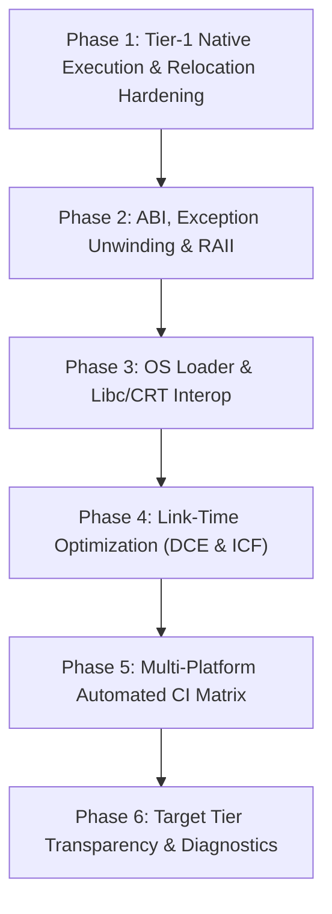

# AdeshLang & AdeshLink: Production Readiness Roadmap

This document outlines the engineering plan to harden the Adesh native toolchain (`adeshlink`), runtime ABI, and compiler pipeline into a rock-solid, production-ready system.

---

## 🧭 Executive Summary

Following the architecture overhaul in PR #5 ("Adesh Native Toolchain Hardening & Complete Language Interoperability"), the compiler and linker possess a fully independent toolchain architecture (ADOB v2 object format, PE/ELF/Mach-O/WASM binary writers, structured linker diagnostics, and tool replacements).

The next major milestone is **Tier-1 Native Execution Hardening**: ensuring that all Tier-1 targets (x86_64 Windows, x86_64 Linux, AArch64 Linux, AArch64 macOS, WASM32-WASI) compile, link, and execute flawlessly with zero external toolchain requirements (no GCC, Clang, MSVC, or LLVM LLD).

---

## 🗺️ Phases of Execution

---

## 🔨 Phase 1: Tier-1 Native Execution & Relocation Hardening

### 1.1 Fix 32-bit Displacement & Section Proximity (Resolving `LNK005`)
- **Problem:** On x86_64 (Small Code Model), code, data, and import trampolines must reside within $\pm 2\text{ GB}$ of each other. When runtime sections or external object slices are assigned distant virtual addresses, `PC32` and `PLT32` branch relocations overflow.
- **Implementation:**
  - Audit and fix `linker/src/layout.rs`: pack `.text`, `.rdata`, `.data`, `.bss`, and synthetic import thunks into contiguous 4KB/64KB aligned virtual address spaces.
  - Fix section layout calculation in Windows PE32+ (`0x140000000` base) and Linux ELF64 (`0x400000` base).
  - Handle intra-object and inter-object `PC32` relocations with precise place VA vs target symbol VA resolution.

### 1.2 Deterministic `crt0` & OS Entry Point Protocol
- **Windows PE32+:** Synthesize `mainCRTStartup` / entry point that initializes the process, calls `main`, and invokes `ExitProcess` from `kernel32.dll`.
- **Linux ELF64:** Ensure `_start` correctly extracts `argc`, `argv`, `envp`, and `auxv` from the initial stack layout before calling the entry point.
- **macOS Mach-O:** Align `LC_MAIN` with the 64-bit entry offset.

---

## 🛡️ Phase 2: ABI, Exception Unwinding & RAII Drop Tables

### 2.1 Standardized Runtime ABI (`ADESH_RUNTIME_ABI_V1`)
- Standardize all core data types across compiler backends (Native JIT, AOT, interpreter, and linker):
  - **String:** `{ ptr: *const u8, len: usize, cap: usize, flags: u32 }`
  - **Array / Slice:** `{ data: *mut u8, len: usize, cap: usize, elem_size: usize }`
  - **Closure:** `{ fn_ptr: *const (), env_ptr: *mut () }`
  - **Result / Option:** Standard tagged union discriminant layout.

### 2.2 Native OS Stack Unwinding Integration
- **Windows x64 SEH:** Emit valid `.pdata` function table entries and `.xdata` unwind codes (`UWOP_PUSH_NONVOL`, `UWOP_ALLOC_LARGE`) for exception handling and debugger backtraces.
- **Linux / macOS DWARF & `.eh_frame`:** Generate valid CIE/FDE records with binary-search `.eh_frame_hdr` headers.

---

## 🌐 Phase 3: OS Loader & Libc/CRT Interoperability

### 3.1 Dynamic & Import Table Synthesis
- **Windows:**
  - Auto-generate complete PE Import Directory Tables (IDT), Import Address Tables (IAT), and Import Lookup Tables (ILT) for `kernel32.dll`, `msvcrt.dll` / `ucrtbase.dll`, and `ws2_32.dll`.
- **Linux:**
  - Support pure static direct-syscall mode (`syscall` instruction) AND dynamic linking against `libc.so.6` with `.dynsym`, `.dynamic`, and `.hash`/`.gnu.hash`.
- **macOS:**
  - Link with `/usr/lib/libSystem.B.dylib` and perform ad-hoc code-signing (`codesign -s -`).

---

## ⚡ Phase 4: Link-Time Optimization (DCE & ICF Hardening)

### 4.1 Dead Code Elimination (`--gc-sections`)
- Define explicit keep-roots: entry points (`_start`, `mainCRTStartup`, `main`), exported functions (`#[export]`), and unwind headers.
- Traverse the directed reference graph of relocations and strip unreferenced sections before computing output binary offsets.

### 4.2 Identical Code Folding (ICF)
- Hash section bytecode and relocation graphs to deduplicate identical read-only functions and constants safely.

---

## 🧪 Phase 5: Multi-Platform Automated CI Matrix

Create automated end-to-end tests across host environments:
- **Windows x86_64:** `adesh build` $\to$ PE `.exe` $\to$ verify execution, console output, exit code.
- **Linux x86_64:** `adesh build` $\to$ ELF64 $\to$ verify execution on Ubuntu and Alpine (musl).
- **macOS AArch64:** `adesh build` $\to$ Mach-O $\to$ verify Apple Silicon execution.
- **WASM32-WASI:** `adesh build` $\to$ `.wasm` $\to$ execute in Wasmtime / Node.js.

---

## 🏷️ Phase 6: Target Tier Transparency & Diagnostics

- **Tier 1 (Production Ready):** `x86_64-pc-windows-msvc`, `x86_64-unknown-linux-gnu`, `x86_64-unknown-linux-musl`, `aarch64-unknown-linux-gnu`, `aarch64-apple-darwin`, `wasm32-wasi`.
- **Tier 2 (Experimental Native):** `riscv64gc-unknown-linux-gnu`, `armv7-unknown-linux-gnueabihf`, `ppc64le-unknown-linux-gnu`.
- **Tier 3 (Domain Containers / Payloads):** GPU Fatbins (CUDA/ROCm/SPIR-V), TPU container, Quantum QIR/OpenQASM, Embedded Baremetal.
- Emit structured compiler diagnostics when targeting Tier-2/3 targets without active runtime runners.
